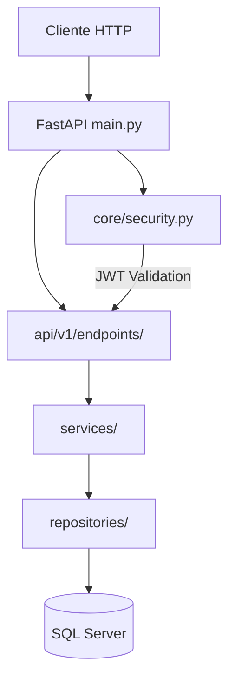
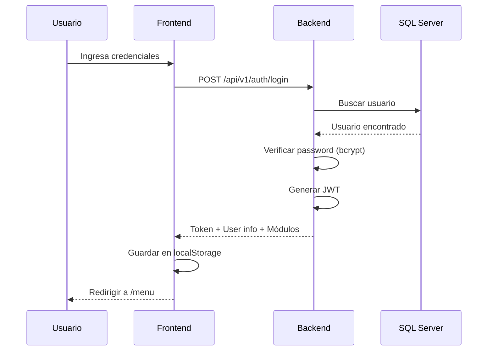
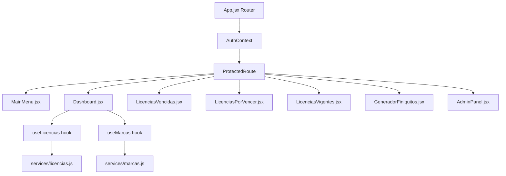

# Dashboard Licencias - Arquitectura Completa

## Visión General

Aplicación web empresarial para gestión de **licencias médicas**, **marcas de empleados** y **administración de usuarios**, construida con:

| Capa              | Tecnología            |
| ----------------- | --------------------- |
| **Backend**       | FastAPI (Python 3.13) |
| **Frontend**      | React 18 + Vite       |
| **Base de Datos** | SQL Server (2 BDs)    |
| **Autenticación** | JWT (JSON Web Tokens) |
| **Proxy**         | Nginx (producción)    |

---

## Estructura del Proyecto

```
dashboard-licencias/
├── backend/                    # API REST
│   ├── app/
│   │   ├── api/v1/
│   │   │   ├── endpoints/      # Endpoints por dominio
│   │   │   │   ├── auth.py     # Login, logout, /me
│   │   │   │   ├── admin.py    # CRUD usuarios, roles, módulos
│   │   │   │   ├── licencias.py
│   │   │   │   └── marcas.py
│   │   │   └── api.py          # Router principal
│   │   │
│   │   ├── core/               # Configuración central
│   │   │   ├── config.py       # Settings y URLs de BD
│   │   │   └── security.py     # JWT, password hashing, decoradores
│   │   │
│   │   ├── db/                 # Conexiones a BD
│   │   │   ├── base.py         # Base declarativa (Alembic)
│   │   │   ├── session.py      # Engine BD Licencias
│   │   │   ├── session_marcas.py # Engine BD Marcas
│   │   │   └── deps.py         # Dependencias (get_db, get_marcas_db)
│   │   │
│   │   ├── repositories/       # Capa de acceso a datos
│   │   │   ├── licencias_repository.py
│   │   │   ├── marcas_repository.py
│   │   │   └── auth_repository.py
│   │   │
│   │   ├── services/           # Lógica de negocio
│   │   │   ├── licencias_service.py
│   │   │   ├── marcas_service.py
│   │   │   └── auth_service.py
│   │   │
│   │   ├── models/             # Modelos SQLAlchemy
│   │   │   ├── licencias.py    # Modelo Licencia
│   │   │   └── auth.py         # Usuario, Rol, Modulo, RolModulo
│   │   │
│   │   ├── schemas/            # Schemas Pydantic (validación)
│   │   │   ├── licencias.py
│   │   │   └── auth.py
│   │   │
│   │   └── main.py             # Punto de entrada FastAPI
│   │
│   ├── .env                    # Variables de entorno
│   └── requirements.txt
│
└── frontend/                   # SPA React
    ├── src/
    │   ├── pages/              # Vistas principales
    │   │   ├── Login.jsx       # Página de login
    │   │   ├── MainMenu.jsx    # Menú principal
    │   │   ├── Dashboard.jsx   # Dashboard con tarjetas y marcas
    │   │   ├── LicenciasVencidas.jsx
    │   │   ├── LicenciasPorVencer.jsx
    │   │   ├── LicenciasVigentes.jsx
    │   │   ├── GeneradorFiniquitos.jsx
    │   │   └── admin/
    │   │       └── AdminPanel.jsx  # Gestión de usuarios
    │   │
    │   ├── components/         # Componentes reutilizables
    │   │   └── ProtectedRoute.jsx  # HOC para rutas protegidas
    │   │
    │   ├── context/
    │   │   └── AuthContext.jsx # Estado global de autenticación
    │   │
    │   ├── hooks/              # Custom hooks
    │   │   ├── useLicencias.js
    │   │   └── useMarcas.js
    │   │
    │   ├── services/           # Llamadas HTTP
    │   │   ├── api.js          # Axios config base
    │   │   ├── auth.js         # Auth service
    │   │   ├── licencias.js
    │   │   └── marcas.js
    │   │
    │   ├── App.jsx             # Router y rutas
    │   └── main.jsx            # Entry point
    │
    └── package.json
```

---

## Backend - Arquitectura en Capas



### Flujo de una Request

1. **Endpoint** recibe la request y valida input con Pydantic schemas
2. **Security** valida JWT token y permisos (decoradores `require_role`)
3. **Service** contiene la lógica de negocio
4. **Repository** ejecuta queries SQL usando SQLAlchemy
5. **Response** se serializa con Pydantic y retorna JSON

### Archivos Clave del Backend

| Archivo                     | Propósito                               |
| --------------------------- | --------------------------------------- |
| `main.py`                   | Inicialización FastAPI, CORS, routers   |
| `core/config.py`            | Variables de entorno, URLs de conexión  |
| `core/security.py`          | JWT encoding/decoding, password hashing |
| `api/v1/api.py`             | Router que agrupa todos los endpoints   |
| `db/base.py`                | Base declarativa para modelos (Alembic) |
| `db/deps.py`                | Dependencias para inyectar sesiones DB  |
| `api/v1/endpoints/auth.py`  | Login, logout, verificación de token    |
| `api/v1/endpoints/admin.py` | CRUD de usuarios, roles y módulos       |

---

## Sistema de Autenticación

### Flujo de Login



### Modelo de Permisos

```
Usuario (1) ──── (1) Rol (1) ──── (*) RolModulo (*) ──── (1) Modulo
```

| Rol     | Módulos                      |
| ------- | ---------------------------- |
| admin   | dashboard, finiquitos, admin |
| rrhh    | dashboard, finiquitos        |
| usuario | dashboard                    |

### Protección de Rutas

**Backend (Decoradores):**

```python
@router.get("/users")
async def list_users(
    current_user: Usuario = Depends(require_role(["admin"]))
):
    ...
```

**Frontend (ProtectedRoute):**

```jsx
<ProtectedRoute requiredModule="admin">
  <AdminPanel />
</ProtectedRoute>
```

---

## Bases de Datos

### BD 1: Licencias (Principal)

```
Variables: DB_SERVER, DB_USER, DB_PASSWORD, DB_NAME
Sesión: app/db/session.py
Tablas:
  - Licencias (licencias médicas)
  - Usuario, Rol, Modulo, RolModulo (autenticación)
```

### BD 2: Marcas (MorphoManager)

```
Variables: MARCAS_DB_SERVER, MARCAS_DB_USER, MARCAS_DB_PASSWORD, MARCAS_DB_NAME
Sesión: app/db/session_marcas.py
Tablas:
  - tbNombre (empleados)
  - Eventos (marcas de entrada/salida)
  - Clocks (relojes biométricos)
```

> **Nota**: Las contraseñas con caracteres especiales (`@`, `#`) se codifican con `quote_plus()` en `config.py`

---

## API Endpoints

### Autenticación (`/api/v1/auth`)

| Método | Ruta       | Protección | Descripción                    |
| ------ | ---------- | ---------- | ------------------------------ |
| POST   | `/login`   | Pública    | Autenticar y obtener JWT       |
| GET    | `/me`      | JWT        | Info del usuario actual        |
| GET    | `/modules` | JWT        | Módulos permitidos del usuario |
| POST   | `/logout`  | JWT        | Cerrar sesión (stateless)      |

### Licencias (`/api/v1/licencias`)

| Método | Ruta                         | Descripción                             |
| ------ | ---------------------------- | --------------------------------------- |
| GET    | `/`                          | Lista paginada de licencias             |
| GET    | `/vigentes`                  | Licencias activas (fecha actual)        |
| GET    | `/por-vencer?dias=N`         | Licencias que vencen en próximos N días |
| GET    | `/vencidas-recientes?dias=N` | Licencias vencidas hace N días          |
| GET    | `/{id}`                      | Detalle de una licencia                 |
| POST   | `/`                          | Crear nueva licencia                    |

### Marcas (`/api/v1/marcas`)

| Método | Ruta       | Descripción                                  |
| ------ | ---------- | -------------------------------------------- |
| GET    | `/`        | Marcas con filtros (fecha, nombre, rut, etc) |
| GET    | `/relojes` | Lista de relojes/torniquetes                 |
| GET    | `/hoy`     | Marcas del día actual (legacy)               |

**Parámetros de filtro (`/marcas`):**

- `limit`, `offset` - Paginación (max 500)
- `fecha_inicio`, `fecha_fin` - Rango de fechas (YYYY-MM-DD)
- `nombre`, `rut` - Búsqueda por empleado
- `reloj` - Filtro por torniquete
- `tipo_marca` - `IN` (entrada) o `OUT` (salida)

### Administración (`/api/v1/admin`) - Solo rol `admin`

| Método | Ruta                               | Descripción               |
| ------ | ---------------------------------- | ------------------------- |
| GET    | `/users`                           | Listar todos los usuarios |
| POST   | `/users`                           | Crear nuevo usuario       |
| GET    | `/users/{id}`                      | Obtener usuario por ID    |
| PUT    | `/users/{id}`                      | Actualizar usuario        |
| DELETE | `/users/{id}`                      | Desactivar usuario (soft) |
| GET    | `/roles`                           | Listar roles disponibles  |
| GET    | `/modules`                         | Listar todos los módulos  |
| PUT    | `/modules/{id}/toggle?active=bool` | Activar/desactivar módulo |

---

## Frontend - Componentes



### Archivos Clave del Frontend

| Archivo                         | Propósito                                    |
| ------------------------------- | -------------------------------------------- |
| `App.jsx`                       | Rutas con react-router-dom v6                |
| `context/AuthContext.jsx`       | Estado global de auth (user, token, modulos) |
| `components/Navbar.jsx`         | Barra de navegación con info usuario/logout  |
| `components/ProtectedRoute.jsx` | HOC para validar auth y permisos de módulo   |
| `pages/Login.jsx`               | Formulario de login                          |
| `pages/MainMenu.jsx`            | Menú principal con cards de módulos          |
| `pages/Dashboard.jsx`           | Tarjetas de licencias + tabla de marcas      |
| `pages/admin/AdminPanel.jsx`    | CRUD de usuarios                             |
| `hooks/useLicencias.js`         | Hook para API licencias                      |
| `hooks/useMarcas.js`            | Hook para API marcas con paginación          |

---

## Rutas Frontend

| Ruta                    | Componente          | Protección          |
| ----------------------- | ------------------- | ------------------- |
| `/login`                | Login               | Pública             |
| `/`                     | → Redirect          | → `/menu`           |
| `/menu`                 | MainMenu            | Autenticado         |
| `/dashboard`            | Dashboard           | Módulo `dashboard`  |
| `/dashboard/vencidas`   | LicenciasVencidas   | Módulo `dashboard`  |
| `/dashboard/por-vencer` | LicenciasPorVencer  | Módulo `dashboard`  |
| `/dashboard/vigentes`   | LicenciasVigentes   | Módulo `dashboard`  |
| `/finiquitos`           | GeneradorFiniquitos | Módulo `finiquitos` |
| `/admin`                | AdminPanel          | Módulo `admin`      |
| `*`                     | → Redirect          | → `/menu`           |

**Rutas Legacy (redirect automático):**

- `/vencidas` → `/dashboard/vencidas`
- `/por-vencer` → `/dashboard/por-vencer`
- `/vigentes` → `/dashboard/vigentes`

---

## Configuración de Desarrollo

### Backend

```bash
cd backend
python -m venv venv
.\venv\Scripts\activate          # Windows
source venv/bin/activate         # macOS/Linux
pip install -r requirements.txt
python -m uvicorn app.main:app --reload
# API: http://localhost:8000
# Docs: http://localhost:8000/docs
```

### Frontend

```bash
cd frontend
npm install
npm run dev
# App: http://localhost:5173
```

### Variables de Entorno (`.env`)

```env
# === Base de Datos Licencias ===
DB_SERVER=servidor
DB_USER=usuario
DB_PASSWORD=password
DB_NAME=nombre_bd

# === Base de Datos Marcas ===
MARCAS_DB_SERVER=servidor
MARCAS_DB_USER=usuario
MARCAS_DB_PASSWORD=password
MARCAS_DB_NAME=MorphoManager

# === JWT Authentication ===
JWT_SECRET_KEY=tu-clave-secreta-cambiar-en-produccion
JWT_ALGORITHM=HS256
JWT_EXPIRE_MINUTES=480
```

---

## Guía para Nuevas Funcionalidades

### Agregar nuevo endpoint

1. Crear repository en `repositories/nuevo_repository.py`
2. Crear service en `services/nuevo_service.py`
3. Crear schemas en `schemas/nuevo.py`
4. Crear endpoint en `api/v1/endpoints/nuevo.py`
5. Registrar en `api/v1/api.py`:

```python
from app.api.v1.endpoints import nuevo
api_router.include_router(nuevo.router, prefix="/nuevo", tags=["nuevo"])
```

### Agregar nueva página frontend

1. Crear componente en `pages/NuevaPagina.jsx`
2. Agregar ruta en `App.jsx`:

```jsx
<Route
  path="/nueva-ruta"
  element={
    <ProtectedRoute requiredModule="modulo_requerido">
      <NuevaPagina />
    </ProtectedRoute>
  }
/>
```

### Agregar nuevo módulo

1. Insertar en tabla `Modulo` de la BD
2. Asignar permisos en tabla `RolModulo`
3. Crear componente frontend
4. Agregar ruta con `<ProtectedRoute requiredModule="nombre_modulo">`

### Agregar nueva base de datos

1. Agregar variables en `core/config.py`
2. Crear `db/session_nueva.py` con engine y SessionLocal
3. Agregar `get_nueva_db()` en `db/deps.py`
4. Usar como dependencia en endpoints:

```python
@router.get("/data")
def get_data(db: Session = Depends(get_nueva_db)):
    ...
```

---

## Valores de FUNCTIONKEY (Marcas)

| Valor | Significado | Display    |
| ----- | ----------- | ---------- |
| 0     | No key      | Gris       |
| 6     | Entrada     | IN (Verde) |
| 7     | Salida      | OUT (Rojo) |

---

## Seguridad

### JWT Token

- **Algoritmo:** HS256
- **Expiración:** 8 horas (configurable)
- **Storage:** localStorage (frontend)
- **Header:** `Authorization: Bearer <token>`

### Password Hashing

- **Librería:** bcrypt (passlib)
- **Salt:** Automático

### CORS (Desarrollo)

```python
app.add_middleware(
    CORSMiddleware,
    allow_origins=["http://localhost:5173"],
    allow_credentials=True,
    allow_methods=["*"],
    allow_headers=["*"],
)
```

---

## Checklist de Producción

- [ ] Cambiar `JWT_SECRET_KEY` a valor aleatorio seguro
- [ ] Configurar HTTPS (Let's Encrypt + Certbot)
- [ ] Restringir CORS a dominio de producción
- [ ] Configurar firewall (UFW)
- [ ] Configurar backups de BD
- [ ] Configurar monitoreo y logs
- [ ] Revisar permisos de archivos
