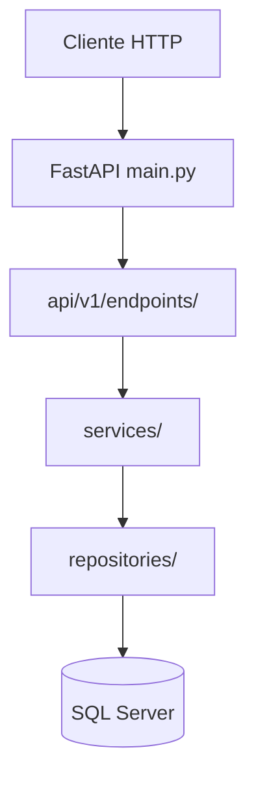
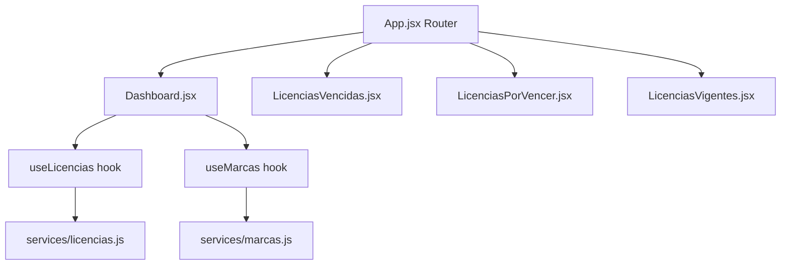

# Dashboard Licencias - Arquitectura Completa

## Visión General

Aplicación web para gestión de **licencias médicas** y **marcas de empleados**, construida con:

| Capa              | Tecnología            |
| ----------------- | --------------------- |
| **Backend**       | FastAPI (Python 3.13) |
| **Frontend**      | React + Vite          |
| **Base de Datos** | SQL Server (2 BDs)    |

---

## Estructura del Proyecto

```
dashboard-licencias/
├── backend/                    # API REST
│   ├── app/
│   │   ├── api/v1/             # Endpoints
│   │   ├── core/               # Config, logging, excepciones
│   │   ├── db/                 # Conexiones a BD
│   │   ├── repositories/       # Queries SQL
│   │   ├── services/           # Lógica de negocio
│   │   ├── models/             # Modelos SQLAlchemy
│   │   └── main.py             # Punto de entrada
│   ├── .env                    # Variables de entorno
│   └── requirements.txt
│
└── frontend/                   # SPA React
    ├── src/
    │   ├── pages/              # Componentes de página
    │   ├── hooks/              # Custom hooks
    │   ├── services/           # Llamadas HTTP
    │   └── App.jsx             # Router principal
    └── package.json
```

---

## Backend - Arquitectura en Capas



### Archivos Clave

| Archivo                                                                                                  | Propósito                              |
| -------------------------------------------------------------------------------------------------------- | -------------------------------------- |
| [main.py](file:///c:/Users/bgacitua/Desktop/Benja/Devs/dashboard-licencias/backend/app/main.py)          | Inicialización FastAPI, CORS, handlers |
| [config.py](file:///c:/Users/bgacitua/Desktop/Benja/Devs/dashboard-licencias/backend/app/core/config.py) | Variables de entorno, URLs de conexión |
| [api.py](file:///c:/Users/bgacitua/Desktop/Benja/Devs/dashboard-licencias/backend/app/api/v1/api.py)     | Router que agrupa todos los endpoints  |
| [deps.py](file:///c:/Users/bgacitua/Desktop/Benja/Devs/dashboard-licencias/backend/app/db/deps.py)       | Dependencias para inyectar sesiones DB |

---

## Bases de Datos

### BD 1: Licencias Médicas

```
Variables: DB_SERVER, DB_USER, DB_PASSWORD, DB_NAME
Sesión: app/db/session.py
```

### BD 2: Marcas (MorphoManager)

```
Variables: MARCAS_DB_SERVER, MARCAS_DB_USER, MARCAS_DB_PASSWORD, MARCAS_DB_NAME
Sesión: app/db/session_marcas.py
```

> **Nota**: Las contraseñas con caracteres especiales (`@`, `#`) se codifican con `quote_plus()` en `config.py`

---

## API Endpoints

### Licencias (`/api/v1/licencias`)

| Método | Ruta          | Descripción                                  |
| ------ | ------------- | -------------------------------------------- |
| GET    | `/resumen`    | Conteo de vencidas, por vencer, vigentes     |
| GET    | `/vencidas`   | Lista licencias vencidas (últimos 5 días)    |
| GET    | `/por-vencer` | Lista licencias que vencen (próximos 5 días) |
| GET    | `/vigentes`   | Lista licencias activas hoy                  |

### Marcas (`/api/v1/marcas`)

| Método | Ruta       | Descripción                     |
| ------ | ---------- | ------------------------------- |
| GET    | `/`        | Marcas con filtros y paginación |
| GET    | `/relojes` | Lista de relojes disponibles    |
| GET    | `/hoy`     | Marcas del día (legacy)         |

**Parámetros de filtro (`/api/v1/marcas`):**

- `limit`, `offset` - Paginación
- `fecha_inicio`, `fecha_fin` - Rango de fechas
- `nombre`, `rut` - Búscan en todo el historial
- `reloj` - Filtro por torniquete
- `tipo_marca` - `IN` (6) o `OUT` (7)

---

## Frontend - Componentes



### Archivos Clave

| Archivo                                                                                                                | Propósito                                         |
| ---------------------------------------------------------------------------------------------------------------------- | ------------------------------------------------- |
| [App.jsx](file:///c:/Users/bgacitua/Desktop/Benja/Devs/dashboard-licencias/frontend/src/App.jsx)                       | Rutas con react-router-dom                        |
| [Dashboard.jsx](file:///c:/Users/bgacitua/Desktop/Benja/Devs/dashboard-licencias/frontend/src/pages/Dashboard.jsx)     | Página principal, tarjetas, filtros, tabla marcas |
| [useLicencias.js](file:///c:/Users/bgacitua/Desktop/Benja/Devs/dashboard-licencias/frontend/src/hooks/useLicencias.js) | Hook para API licencias                           |
| [useMarcas.js](file:///c:/Users/bgacitua/Desktop/Benja/Devs/dashboard-licencias/frontend/src/hooks/useMarcas.js)       | Hook para API marcas con paginación y filtros     |

---

## Rutas Frontend

| Ruta          | Componente         | Descripción                |
| ------------- | ------------------ | -------------------------- |
| `/`           | Dashboard          | Resumen + marcas           |
| `/vencidas`   | LicenciasVencidas  | Tabla licencias vencidas   |
| `/por-vencer` | LicenciasPorVencer | Tabla licencias por vencer |
| `/vigentes`   | LicenciasVigentes  | Tabla licencias vigentes   |

---

## Configuración de Desarrollo

### Backend

```bash
cd backend
python -m venv venv
.\venv\Scripts\activate
pip install -r requirements.txt
python -m uvicorn app.main:app --reload
# Corre en http://localhost:8000
```

### Frontend

```bash
cd frontend
npm install
npm run dev
# Corre en http://localhost:5173
```

### Variables de Entorno (`.env`)

```env
# BD Licencias
DB_SERVER=servidor
DB_USER=usuario
DB_PASSWORD=password
DB_NAME=nombre_bd

# BD Marcas
MARCAS_DB_SERVER=servidor
MARCAS_DB_USER=usuario
MARCAS_DB_PASSWORD=password
MARCAS_DB_NAME=MorphoManager
```

---

## Guía para Nuevas Funcionalidades

### Agregar nuevo endpoint

1. Crear repository en `repositories/nuevo_repository.py`
2. Crear service en `services/nuevo_service.py`
3. Crear endpoint en `api/v1/endpoints/nuevo.py`
4. Registrar en `api/v1/api.py`:

```python
from app.api.v1.endpoints import nuevo
api_router.include_router(nuevo.router, prefix="/nuevo", tags=["nuevo"])
```

### Agregar nueva página frontend

1. Crear componente en `pages/NuevaPagina.jsx`
2. Agregar ruta en `App.jsx`:

```jsx
<Route path="/nueva-ruta" element={<NuevaPagina />} />
```

### Agregar nueva base de datos

1. Agregar variables en `core/config.py`
2. Crear `db/session_nueva.py` con engine y SessionLocal
3. Agregar `get_nueva_db()` en `db/deps.py`
4. Usar como dependencia en endpoints

---

## Valores de FUNCTIONKEY (Marcas)

| Valor | Significado | Display    |
| ----- | ----------- | ---------- |
| 0     | No key      | Gris       |
| 6     | Entrada     | IN (Verde) |
| 7     | Salida      | OUT (Rojo) |
